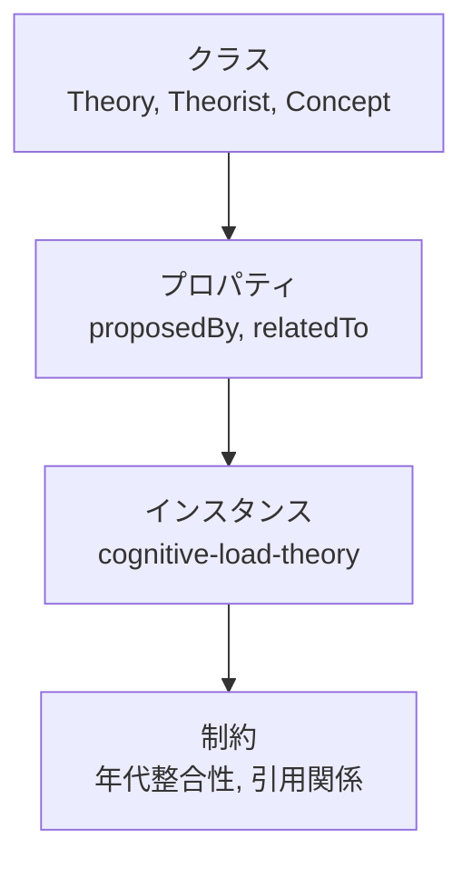
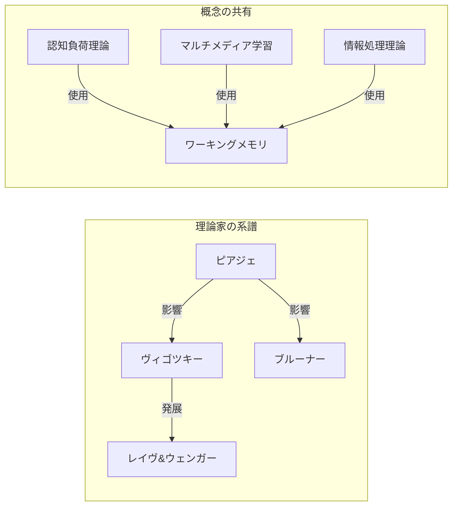

title: 生成AIと教育理論オントロジーが引き起こすパラダイムシフト ー TENGIN Education Theory MCP Server

# 第1章 はじめに

## 1.1 本記事の目的

本記事では、**TENGIN Education Theory MCP Server**と生成AIの組み合わせが、教育コンテンツ生成においてどのようなパラダイムシフトを引き起こすのかを、**オントロジー工学**の観点から解説します。

## 1.2 対象読者

- 教育工学・インストラクショナルデザインに関心のある方
- 生成AI（Claude、GPT等）を教育分野で活用したい方
- ナレッジグラフ・オントロジー工学に興味のある方
- MCP（Model Context Protocol）の実用例を知りたい開発者

## 1.3 キーワード

`オントロジー` `ナレッジグラフ` `生成AI` `MCP` `教育理論` `GraphRAG` `エビデンスベース`

---

# 第2章 従来のAI教育コンテンツ生成の限界

## 2.1 生成AIの「幻覚」問題

生成AIは膨大なテキストデータで学習していますが、教育理論に関しては以下の問題があります。

```
❌ 問題1: 不正確な引用
「ブルーナーは1975年に構成主義を提唱した」
→ 実際はピアジェが1966年

❌ 問題2: 理論の混同
「認知負荷理論の3つの動機づけ要素」
→ 認知負荷は動機づけではなく認知プロセスの理論

❌ 問題3: エビデンスの欠如
「この教授法は非常に効果的です」
→ 効果量やメタ分析への言及がない
```

## 2.2 「暗黙知」としての教育理論

従来の生成AIにとって、教育理論は**テキストの中に埋もれた暗黙知**でした。

| 課題 | 説明 |
|------|------|
| 体系的整理の欠如 | 38の理論が8つのパラダイムに分類されていることを知らない |
| 関係性の不明確さ | ヴィゴツキーとピアジェの理論的対立を理解していない |
| エビデンスレベルの無視 | 効果量0.82の足場かけと0.40の探究学習を同列に扱う |

---

# 第3章 オントロジー工学とは何か

## 3.1 オントロジーの定義

**オントロジー**とは、特定の領域における概念とその関係を形式的に記述したものです。

```
オントロジー = 概念 + 関係 + 制約 + インスタンス
```

哲学では「存在論」を意味しますが、情報科学では**共有可能な概念体系**として活用されます。

## 3.2 オントロジーの構成要素



## 3.3 教育理論オントロジーの意義

教育理論をオントロジーとして形式化することで：

1. **明示的知識化** - 暗黙知を機械可読な形式に変換
2. **推論可能性** - 理論間の関係から新たな知見を導出
3. **品質保証** - エビデンスレベルに基づく信頼性評価
4. **再利用性** - 異なるAIシステム間での知識共有

---

# 第4章 なぜRAGではなくGraphRAGなのか

## 4.1 従来のRAG（Retrieval-Augmented Generation）の限界

RAGは「検索して生成する」シンプルなアプローチですが、教育理論のような**構造化された知識体系**には限界があります。

```
┌─────────────────────────────────────────────────────────┐
│  従来のRAG                                              │
│                                                         │
│  Query → ベクトル検索 → 類似ドキュメント → LLM生成     │
│                                                         │
│  問題: ドキュメント間の「関係性」が失われる            │
└─────────────────────────────────────────────────────────┘
```

### RAGの問題点

| 問題 | 具体例 |
|------|--------|
| **関係性の喪失** | 「認知負荷理論」と「マルチメディア学習理論」が同じ概念（ワーキングメモリ）を共有していることを検索できない |
| **文脈の断片化** | チャンク分割により、理論の全体像が見えなくなる |
| **推論の欠如** | 「Aの弟子BがCに影響を与えた」といった間接的関係を発見できない |
| **階層構造の無視** | 8つのパラダイム→38の理論→25の概念という階層が平坦化される |

## 4.2 GraphRAGの優位性

**GraphRAG**は、知識をグラフ構造として保持することで、RAGの限界を克服します。

```
┌─────────────────────────────────────────────────────────┐
│  GraphRAG                                               │
│                                                         │
│  Query → グラフトラバース → 関連ノード群 → LLM生成    │
│          ＋ベクトル検索     ＋関係性情報                │
│                                                         │
│  利点: 構造・関係性・文脈を保持したまま検索           │
└─────────────────────────────────────────────────────────┘
```

### GraphRAGが解決すること

```python
# 例: 「認知主義パラダイムの理論で、ワーキングメモリに関連するもの」
# 
# RAG: 「認知主義」「ワーキングメモリ」でベクトル検索
#      → 断片的なドキュメントがヒット、関係性不明
#
# GraphRAG: グラフクエリで構造的に取得
MATCH (t:Theory)-[:HAS_CONCEPT]->(c:Concept)
WHERE t.paradigm = 'cognitivism' 
  AND c.name CONTAINS 'ワーキングメモリ'
RETURN t, c

# 結果: 認知負荷理論、マルチメディア学習理論、情報処理理論
#       + それぞれの関係性と文脈
```

## 4.3 教育理論に GraphRAG が最適な理由

教育理論は本質的に**ネットワーク構造**を持っています。



| 特性 | RAG | GraphRAG |
|------|-----|----------|
| 理論間の影響関係 | ❌ 検索不可 | ✅ エッジとしてモデル化 |
| 概念の共有関係 | ❌ 偶然のヒット | ✅ 明示的にトラバース |
| パラダイム階層 | ❌ フラット化 | ✅ 階層構造を保持 |
| マルチホップ推論 | ❌ 不可能 | ✅ 複数ホップのパス探索 |
| エビデンスの紐付け | ❌ 曖昧 | ✅ 明示的なリンク |

## 4.4 TENGINにおけるハイブリッドアプローチ

TENGINは**GraphRAG + ベクトル検索**のハイブリッドアプローチを採用しています。

```
                    ユーザークエリ
                         │
           ┌─────────────┴─────────────┐
           ▼                           ▼
    ┌──────────────┐           ┌──────────────┐
    │  ChromaDB    │           │    Neo4j     │
    │ ベクトル検索  │           │ グラフ検索    │
    │ (セマンティック)│           │ (構造・関係)  │
    └──────────────┘           └──────────────┘
           │                           │
           └─────────────┬─────────────┘
                         ▼
                   結果のマージ
                   ＋ランキング
                         │
                         ▼
                  LLMによる生成
                 (構造化された文脈付き)
```

- **ベクトル検索**: 自然言語クエリの意味的類似性でエントリーポイントを発見
- **グラフ検索**: 発見したノードから関係性をトラバースして文脈を拡張

---

# 第5章 TENGIN Education Theory MCPの設計

## 5.1 ナレッジグラフスキーマ

TENGINは**Neo4j**グラフデータベース上に、以下のスキーマで教育理論を格納しています。

```
[Theory] --PROPOSED_BY--> [Theorist]
   |
   +--HAS_CONCEPT--> [Concept]
   |
   +--SUPPORTED_BY--> [Evidence]
   |
   +--INFLUENCES--> [Theory]
   |
   +--APPLICABLE_IN--> [Context]
```

## 5.2 MECE分類によるパラダイム体系

38の教育理論を**8つのパラダイム**に MECE（Mutually Exclusive, Collectively Exhaustive）分類しています。

| パラダイム | 理論数 | 代表理論 |
|-----------|--------|----------|
| 行動主義 | 2 | オペラント条件づけ |
| 認知主義 | 7 | 認知負荷理論 |
| 構成主義 | 8 | 問題解決学習 |
| 社会的認知 | 3 | 自己効力感理論 |
| 社会文化的 | 3 | 社会文化理論 |
| 人間主義 | 4 | 自己決定理論 |
| 教授設計 | 7 | ARCSモデル |
| ネットワーク | 1 | コネクティビズム |

## 5.3 エビデンスレベルの形式化

各理論・教授法には**エビデンスレベル**を付与しています。

```python
class EvidenceLevel(Enum):
    HIGH = "high"        # メタ分析で効果が確認
    MODERATE = "moderate" # 複数の実験研究で支持
    EMERGING = "emerging" # 新興理論、研究継続中
```

---

# 第6章 MCPによるAI統合アーキテクチャ

## 6.1 Model Context Protocol（MCP）とは

**MCP**はAnthropicが提唱するオープンプロトコルで、AIアプリケーションと外部データソースを標準的な方法で接続します。

```
┌─────────────┐     MCP      ┌─────────────────┐
│   Claude    │◄────────────►│  TENGIN Server  │
│  (AI Host)  │   JSON-RPC   │ (MCP Provider)  │
└─────────────┘              └─────────────────┘
                                    │
                              ┌─────┴─────┐
                              ▼           ▼
                          [Neo4j]    [ChromaDB]
                          グラフDB   ベクトルDB
```

## 6.2 TENGINが提供するMCPプリミティブ

### Tools（ツール）- 13種

```python
# 理論検索
search_theories(query="認知負荷", paradigm="cognitivism")

# 理論比較
compare_theories(theory_ids=["self-determination-theory", "flow-theory"])

# 引用生成
cite_theory(theory_id="cognitive-load-theory", format="APA7")
```

### Resources（リソース）- 5種

```
theory://cognitive-load-theory   # 理論詳細
concept://working-memory         # 概念詳細
graph://statistics               # グラフ統計
```

### Prompts（プロンプト）- 6種

```python
# 授業設計支援
design_lesson(topic="分数の足し算", grade_level="小学4年", duration_minutes=45)

# 学習問題診断
troubleshoot_learning(problem="学習者の動機づけが低い", context="大学講義")
```

---

# 第7章 パラダイムシフト：何が変わるのか

## 7.1 Before: 非構造化知識に基づく生成

```
User: 授業設計を手伝って

AI: はい、授業設計についてお手伝いします。
    まず目標を明確にして...（一般的なアドバイス）
```

**問題点**：
- 特定の教育理論への言及がない
- エビデンスに基づいていない
- 再現性がない

## 7.2 After: オントロジーに基づく生成

```
User: 授業設計を手伝って

AI: [search_theories実行]
    [get_evidence_for_theory実行]
    
    分数の足し算の授業設計には、以下の理論的基盤を推奨します。
    
    1. 認知負荷理論（Sweller, 1988）- 効果量0.60
       → 内的負荷の最適化のため、ワークドエクサンプルを活用
    
    2. ガニェの9教授事象（Gagné, 1965）
       → 注意喚起から転移促進まで体系的に設計
    
    3. 足場かけ（効果量0.82）
       → 段階的に支援を減らすfading戦略を採用
```

## 7.3 パラダイムシフトの本質

| 観点 | Before | After |
|------|--------|-------|
| 知識源 | 学習データ（暗黙知） | オントロジー（明示知） |
| 根拠 | なし/曖昧 | エビデンスレベル+効果量 |
| 一貫性 | 毎回異なる回答 | 理論体系に基づく |
| 検証可能性 | 困難 | グラフ探索で追跡可能 |
| 引用 | 不正確/創作 | 形式化された書誌情報 |

---

# 第8章 実践例：オントロジー駆動の授業設計

## 8.1 ユースケース：動機づけに課題のある学習者

```python
# Step 1: 動機づけ関連理論を検索
await search_theories(query="動機づけ", evidence_level="high")

# 結果:
# - 自己決定理論 (evidence: high)
# - ARCSモデル (evidence: high)  
# - フロー理論 (evidence: high)
```

## 8.2 理論間の関係をトラバース

```python
# Step 2: 自己決定理論の関連概念を取得
await traverse_graph(
    start_node_id="self-determination-theory",
    max_depth=2
)

# 結果:
# Theory → HAS_CONCEPT → 自律性、有能感、関係性
# Theory → PROPOSED_BY → デシ、ライアン
# Theory → SUPPORTED_BY → メタ分析（効果量0.55）
```

## 8.3 生成されるコンテンツ

```markdown
## 授業設計：自己決定理論に基づく動機づけ支援

### 理論的基盤
- 自己決定理論（Ryan & Deci, 2017）
- 3つの基本的心理欲求：自律性、有能感、関係性

### 設計原則
1. **自律性支援**: 選択肢の提供、理由の説明
2. **有能感支援**: 適切な難易度、肯定的フィードバック
3. **関係性支援**: グループ活動、教師との信頼関係

### エビデンス
- メタ分析による効果量: 0.55（Howard et al., 2021）
```

---

# 第9章 オントロジー工学から見た革新性

## 9.1 知識の形式的表現

TENGINは教育理論を**計算可能な形式**で表現しています。

```cypher
// Neo4j Cypherクエリ例
MATCH (t:Theory)-[:HAS_CONCEPT]->(c:Concept)
WHERE t.paradigm = 'cognitivism'
RETURN t.name, collect(c.name) as concepts
```

## 9.2 推論と知識発見

オントロジーにより、**明示的に記述されていない関係**を推論できます。

```
Given:
  - 認知負荷理論 → HAS_CONCEPT → ワーキングメモリ
  - マルチメディア学習理論 → HAS_CONCEPT → ワーキングメモリ

Inferred:
  - 認知負荷理論 ↔ マルチメディア学習理論（共通概念による関連）
```

## 9.3 セマンティックWeb技術との接続

TENGINのオントロジーは将来的に**Schema.org**や**Dublin Core**といった標準語彙と連携可能です。

```turtle
# 将来的なRDF表現例
tengin:cognitive-load-theory a schema:ScholarlyArticle ;
    schema:author tengin:john-sweller ;
    schema:datePublished "1988" ;
    tengin:evidenceLevel "high" .
```

---

# 第10章 導入方法

## 10.1 クイックスタート

```bash
# リポジトリをクローン
git clone https://github.com/nahisaho/tenjin-graphrag.git
cd tenjin-graphrag

# 依存関係をインストール
uv sync

# Neo4jを起動
docker compose up -d

# データを投入
uv run python -m tengin_mcp.scripts.seed_data

# サーバー起動
uv run tengin-server
```

## 10.2 Claude Desktop連携

`claude_desktop_config.json`に追加：

```json
{
  "mcpServers": {
    "tengin-education": {
      "command": "uv",
      "args": ["--directory", "/path/to/tenjin-graphrag", "run", "tengin-server"]
    }
  }
}
```

---

# 第11章 まとめと展望

## 11.1 本記事のまとめ

| 観点 | 内容 |
|------|------|
| 課題 | 生成AIの教育理論に関する「幻覚」問題 |
| 解決策 | オントロジーによる知識の形式化 |
| 実装 | TENGIN Education Theory MCP Server |
| 効果 | エビデンスベースで検証可能なコンテンツ生成 |

## 11.2 パラダイムシフトの意義

生成AI + 教育理論オントロジーの組み合わせは、**教育コンテンツ生成の質的転換**をもたらします。

```
従来: AI = 高度な文章生成器
　　　（何を言うかは学習データ次第）

今後: AI = 知識エンジン上のインターフェース
　　　（オントロジーに基づく推論と生成）
```

## 11.3 今後の展望

- **オントロジーの拡張**: 教科内容知識（PCK）の形式化
- **多言語対応**: 国際的な教育理論の統合
- **適応学習**: 学習者モデルとの連携
- **コミュニティ貢献**: オープンな教育オントロジーの構築

---

# 参考文献

- Ryan, R. M., & Deci, E. L. (2017). *Self-Determination Theory*. Guilford Press. [Link](https://www.guilford.com/books/Self-Determination-Theory/Ryan-Deci/9781462538966)
- Kolb, D. A. (2015). *Experiential Learning* (2nd ed.). Pearson. [Link](https://www.pearson.com/en-us/subject-catalog/p/experiential-learning-experience-as-the-source-of-learning-and-development/P200000003106)
- Bandura, A. (1997). *Self-Efficacy: The Exercise of Control*. Worth Publishers. [Link](https://books.google.com/books?id=eJ-PN9g_o-EC)
- Vygotsky, L. S. (1978). *Mind in Society*. Harvard University Press. [Link](https://www.hup.harvard.edu/books/9780674576292)

---

# 関連リンク

- [TENGIN Education Theory MCP Server (GitHub)](https://github.com/nahisaho/tenjin-graphrag)
- [Model Context Protocol (MCP)](https://modelcontextprotocol.io/)
- [Neo4j Graph Database](https://neo4j.com/)

---

**著者**: nahisaho  
**公開日**: 2025年12月26日  
**タグ**: `AI` `教育工学` `オントロジー` `MCP` `GraphRAG` `Claude`
